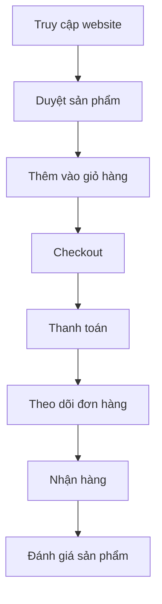
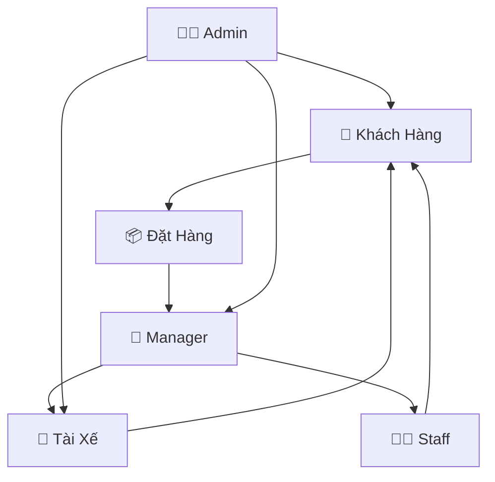

# 👥 Đối Tượng Sử Dụng Hệ Thống DevFoods

## 📊 Phân Nhóm Người Dùng

Dựa trên mục tiêu xây dựng hệ thống quản lý nhà hàng DevFoods, nhóm đã xác định rõ các nhóm người dùng sẽ tham gia hệ thống, đồng thời thực hiện phân tích nhu cầu sử dụng và hành vi của từng đối tượng.

| Nhóm Người Dùng | Vai Trò Chính | Quyền Hạn | Tính Năng Sử Dụng |
|-----------------|---------------|-----------|-------------------|
| **Khách hàng** | Đặt món, thanh toán, đánh giá | Người dùng cuối | Đặt hàng, theo dõi, bình luận |
| **Admin** | Quản trị toàn hệ thống | Toàn quyền | Quản lý tất cả modules |
| **Manager** | Quản lý chi nhánh | Quản lý chi nhánh | Xử lý đơn hàng, quản lý kho |
| **Tài xế** | Giao hàng | Nhận và giao đơn | Cập nhật trạng thái giao hàng |
| **Staff** | Hỗ trợ vận hành | Xử lý đơn hàng | Chat, hỗ trợ khách hàng |

---

## 🎭 Chi Tiết Từng Đối Tượng Sử Dụng

### 1. 👤 **KHÁCH HÀNG (Customer)**

#### **Đặc điểm:**
- **Nhóm chính:** Người tiêu dùng cuối, khách hàng cá nhân
- **Độ tuổi:** 18-45 tuổi, chủ yếu là thế hệ Gen Z và Millennials
- **Hành vi:** Thích đặt đồ ăn online, thanh toán nhanh, theo dõi đơn hàng realtime

#### **Nhu cầu sử dụng:**
```php
// Routes chính cho Customer (routes/customer.php)
Route::middleware([CartCountMiddleware::class, 'phone.required'])->group(function () {
    Route::get('/', [CustomerHomeController::class, 'index'])->name('home');
    Route::get('/shop/products', [CustomerProductController::class, 'index'])->name('products.index');
    Route::get('/shop/products/{slug}', [CustomerProductController::class, 'show'])->name('products.show');
    Route::get('/cart', [CustomerCartController::class, 'index'])->name('cart.index');
    Route::get('/checkout', [CustomerCheckoutController::class, 'index'])->name('checkout.index');
    Route::get('/wishlist', [CustomerWishlistController::class, 'index'])->name('wishlist.index');
});
```

#### **Chức năng sử dụng:**
- ✅ **Duyệt sản phẩm:** Xem menu, combo, tìm kiếm món ăn
- ✅ **Quản lý giỏ hàng:** Thêm/xóa sản phẩm, chọn topping, variant
- ✅ **Đặt hàng:** Checkout, chọn địa chỉ, phương thức thanh toán
- ✅ **Theo dõi đơn hàng:** Xem trạng thái realtime, lịch sử đơn hàng
- ✅ **Đánh giá & bình luận:** Rating sao, viết review, reply
- ✅ **Quản lý tài khoản:** Profile, địa chỉ, số dư, rank thành viên
- ✅ **Yêu thích:** Wishlist sản phẩm, combo
- ✅ **Chat hỗ trợ:** Liên hệ với nhà hàng

#### **Quyền hạn:**
- Truy cập giao diện khách hàng
- Đặt hàng và thanh toán
- Xem lịch sử cá nhân
- Đánh giá sản phẩm đã mua

#### **Luồng sử dụng chính:**


---

### 2. 👨‍💼 **ADMIN (Quản Trị Viên)**

#### **Đặc điểm:**
- **Vai trò:** Quản trị viên cấp cao của hệ thống
- **Trách nhiệm:** Giám sát toàn bộ hoạt động, ra quyết định chiến lược
- **Kỹ năng:** Hiểu biết về công nghệ, quản lý, phân tích dữ liệu

#### **Nhu cầu sử dụng:**
```php
// Routes chính cho Admin (routes/admin.php)
Route::middleware(['auth:admin'])->prefix('admin')->name('admin.')->group(function () {
    Route::get('/', [DashboardController::class, 'dashboard'])->name('dashboard');
    Route::resource('categories', CategoryController::class);
    Route::resource('products', ProductController::class);
    Route::resource('users', UserController::class);
    Route::resource('branches', BranchController::class);
    Route::resource('drivers', DriverController::class);
    Route::prefix('orders')->name('orders.')->group(function () {
        Route::get('/', [OrderController::class, 'index'])->name('index');
        Route::get('/show/{id}', [OrderController::class, 'show'])->name('show');
    });
});
```

#### **Chức năng sử dụng:**
- 📊 **Dashboard tổng quan:** Thống kê doanh thu, đơn hàng, khách hàng
- 🏪 **Quản lý chi nhánh:** CRUD chi nhánh, phân công manager
- 👥 **Quản lý người dùng:** User, role, permissions
- 🍕 **Quản lý sản phẩm:** Products, categories, variants, toppings
- 🚚 **Quản lý tài xế:** Driver applications, assignments, violations
- 📦 **Quản lý đơn hàng:** Xem tất cả đơn, thống kê, báo cáo
- 🎯 **Quản lý khuyến mãi:** Discount codes, promotion programs
- 💬 **Quản lý reviews:** Moderation, reports, replies
- ⚙️ **Cài đặt hệ thống:** General settings, shipping fees

#### **Quyền hạn:**
- Toàn quyền truy cập hệ thống
- Tạo/sửa/xóa tất cả dữ liệu
- Xem báo cáo tổng hợp
- Quản lý phân quyền

#### **Dashboard Admin:**
```php
// Các metrics quan trọng Admin theo dõi
$adminMetrics = [
    'total_revenue' => 'Tổng doanh thu',
    'total_orders' => 'Tổng đơn hàng',
    'total_customers' => 'Tổng khách hàng',
    'active_drivers' => 'Tài xế hoạt động',
    'branch_performance' => 'Hiệu suất chi nhánh',
    'top_products' => 'Sản phẩm bán chạy',
    'customer_satisfaction' => 'Độ hài lòng khách hàng'
];
```

---

### 3. 🏪 **MANAGER (Quản Lý Chi Nhánh)**

#### **Đặc điểm:**
- **Vai trò:** Quản lý một chi nhánh cụ thể
- **Trách nhiệm:** Vận hành chi nhánh, quản lý đơn hàng, nhân viên
- **Phạm vi:** Chỉ quản lý chi nhánh được phân công

#### **Nhu cầu sử dụng:**
```php
// Routes chính cho Branch Manager (routes/branch.php)
Route::middleware(['branch.auth'])->prefix('branch')->name('branch.')->group(function () {
    Route::get('/', [DashboardController::class, 'index'])->name('dashboard');
    Route::prefix('orders')->name('orders.')->group(function () {
        Route::get('/', [BranchOrderController::class, 'index'])->name('index');
        Route::post('/{id}/confirm', [BranchOrderController::class, 'confirmOrder'])->name('confirm');
        Route::post('/{id}/find-driver', [DriverAssignmentController::class, 'findDriver'])->name('find-driver');
    });
    Route::get('/products', [BranchProductController::class, 'index'])->name('products');
});
```

#### **Chức năng sử dụng:**
- 📊 **Dashboard chi nhánh:** Thống kê riêng cho chi nhánh
- 📦 **Xử lý đơn hàng:** Xác nhận, hủy, gán tài xế
- 📋 **Quản lý kho:** Stock management, low stock alerts
- 🚚 **Quản lý giao hàng:** Tìm tài xế, theo dõi giao hàng
- 💬 **Chat khách hàng:** Hỗ trợ khách hàng qua chat
- 👥 **Quản lý nhân viên:** Staff của chi nhánh
- 📈 **Báo cáo chi nhánh:** Doanh thu, hiệu suất

#### **Quyền hạn:**
- Quản lý chi nhánh được phân công
- Xử lý đơn hàng của chi nhánh
- Quản lý kho hàng chi nhánh
- Chat với khách hàng

#### **Luồng xử lý đơn hàng:**
```php
// Quy trình xử lý đơn hàng của Manager
$orderProcessFlow = [
    'receive_order' => 'Nhận đơn hàng mới',
    'check_inventory' => 'Kiểm tra tồn kho',
    'confirm_order' => 'Xác nhận đơn hàng',
    'prepare_food' => 'Chuẩn bị món ăn',
    'find_driver' => 'Tìm tài xế giao hàng',
    'handover' => 'Bàn giao cho tài xế',
    'track_delivery' => 'Theo dõi giao hàng'
];
```

---

### 4. 🚚 **TÀI XẾ (Driver)**

#### **Đặc điểm:**
- **Vai trò:** Giao hàng cho khách hàng
- **Đặc điểm:** Di động cao, sử dụng smartphone
- **Mục tiêu:** Tối ưu thu nhập, giao hàng hiệu quả

#### **Nhu cầu sử dụng:**
```php
// Routes chính cho Driver (routes/driver.php)
Route::middleware('auth:driver')->group(function () {
    Route::get('/', [DriverController::class, 'home'])->name('dashboard');
    Route::get('/orders', [OrderController::class, 'index'])->name('orders.index');
    Route::post('/orders/{order}/confirm', [OrderController::class, 'confirm'])->name('orders.confirm');
    Route::post('/orders/{order}/start-pickup', [OrderController::class, 'startPickup'])->name('orders.start-pickup');
    Route::post('/orders/{order}/confirm-pickup', [OrderController::class, 'confirmPickup'])->name('orders.confirm-pickup');
    Route::post('/orders/{order}/start-delivery', [OrderController::class, 'startDelivery'])->name('orders.start-delivery');
    Route::post('/orders/{order}/confirm-delivery', [OrderController::class, 'confirmDelivery'])->name('orders.confirm-delivery');
    Route::get('/earnings', [DriverController::class, 'earnings'])->name('earnings');
});
```

#### **Chức năng sử dụng:**
- 📱 **Dashboard tài xế:** Đơn hàng khả dụng, thu nhập
- 📦 **Nhận đơn hàng:** Xem chi tiết, xác nhận nhận đơn
- 🗺️ **Navigation:** Chỉ đường đến nhà hàng và khách hàng
- ✅ **Cập nhật trạng thái:** Đã lấy hàng, đang giao, đã giao
- 💰 **Quản lý thu nhập:** Xem lịch sử, thống kê thu nhập
- 👤 **Profile:** Cập nhật thông tin, đổi mật khẩu
- 🔄 **Trạng thái hoạt động:** Online/Offline toggle
- 📞 **Liên hệ:** Chat với chi nhánh, khách hàng

#### **Quyền hạn:**
- Xem đơn hàng được phân công
- Cập nhật trạng thái giao hàng
- Xem thu nhập cá nhân
- Quản lý profile

#### **Quy trình giao hàng:**
```javascript
// Driver workflow
const driverWorkflow = {
    1: "Nhận thông báo đơn hàng mới",
    2: "Xác nhận nhận đơn",
    3: "Di chuyển đến nhà hàng",
    4: "Lấy hàng tại nhà hàng",
    5: "Bắt đầu giao hàng",
    6: "Giao hàng cho khách hàng",
    7: "Xác nhận hoàn thành",
    8: "Nhận thanh toán (nếu COD)"
};
```

#### **Hệ thống thu nhập:**
```php
// Driver earnings calculation
class DriverEarnings {
    public function calculateEarnings($orders) {
        $totalEarnings = 0;
        foreach ($orders as $order) {
            $baseEarning = $order->delivery_fee * 0.8; // 80% phí giao hàng
            $distanceBonus = $this->calculateDistanceBonus($order->distance);
            $timeBonus = $this->calculateTimeBonus($order->delivery_time);
            
            $totalEarnings += $baseEarning + $distanceBonus + $timeBonus;
        }
        return $totalEarnings;
    }
}
```

---

### 5. 👨‍💻 **STAFF (Nhân Viên)**

#### **Đặc điểm:**
- **Vai trò:** Nhân viên hỗ trợ vận hành
- **Trách nhiệm:** Hỗ trợ khách hàng, xử lý đơn hàng
- **Phạm vi:** Các tác vụ được phân quyền

#### **Chức năng sử dụng:**
- 💬 **Chat support:** Hỗ trợ khách hàng qua chat
- 📦 **Xử lý đơn hàng:** Cập nhật trạng thái đơn hàng
- 📞 **Customer service:** Giải đáp thắc mắc
- 📋 **Data entry:** Nhập liệu, cập nhật thông tin

#### **Quyền hạn:**
- Truy cập các chức năng được phân quyền
- Chat với khách hàng
- Cập nhật trạng thái đơn hàng
- Xem thông tin cần thiết

---

## 🎯 **Phân Tích Nhu Cầu Theo Đối Tượng**

### **Khách Hàng - Trải Nghiệm Mua Sắm**
```javascript
// Nhu cầu chính: Đặt hàng nhanh, tiện lợi
const customerNeeds = {
    browsing: "Duyệt menu dễ dàng, tìm kiếm nhanh",
    ordering: "Thêm giỏ hàng, customize món ăn",
    payment: "Thanh toán đa dạng, bảo mật",
    tracking: "Theo dõi đơn hàng realtime",
    feedback: "Đánh giá, bình luận sản phẩm"
};
```

### **Admin - Quản Trị Toàn Diện**
```php
// Nhu cầu chính: Kiểm soát và phân tích
$adminNeeds = [
    'overview' => 'Dashboard tổng quan với metrics quan trọng',
    'management' => 'CRUD tất cả entities trong hệ thống',
    'analytics' => 'Báo cáo chi tiết, export data',
    'control' => 'Phân quyền, cài đặt hệ thống'
];
```

### **Manager - Vận Hành Chi Nhánh**
```php
// Nhu cầu chính: Hiệu quả vận hành
$managerNeeds = [
    'orders' => 'Xử lý đơn hàng nhanh chóng',
    'inventory' => 'Quản lý kho hàng realtime',
    'staff' => 'Phối hợp nhân viên, tài xế',
    'customer' => 'Hỗ trợ khách hàng tốt nhất'
];
```

### **Driver - Giao Hàng Hiệu Quả**
```javascript
// Nhu cầu chính: Tối ưu thu nhập
const driverNeeds = {
    orders: "Nhận đơn phù hợp, gần nhất",
    navigation: "Chỉ đường tối ưu",
    communication: "Liên lạc với khách hàng",
    earnings: "Theo dõi thu nhập, thưởng"
};
```

---

## 📱 **Giao Diện Theo Đối Tượng**

### **Customer Interface**
- **Responsive design** cho mobile và desktop
- **Intuitive navigation** dễ sử dụng
- **Visual product display** với hình ảnh đẹp
- **Quick checkout** process
- **Real-time notifications**

### **Admin Interface**
- **Comprehensive dashboard** với charts và metrics
- **Data tables** với filtering và sorting
- **Modal forms** cho CRUD operations
- **Export functionality** cho báo cáo
- **Role-based access control**

### **Manager Interface**
- **Branch-specific dashboard**
- **Order management** với drag-drop
- **Inventory alerts** và notifications
- **Driver assignment** interface
- **Customer chat** integration

### **Driver Interface**
- **Mobile-first design**
- **Map integration** cho navigation
- **One-tap actions** cho status updates
- **Earnings tracker**
- **Offline capability**

---

## 🔄 **Tương Tác Giữa Các Đối Tượng**



### **Luồng Tương Tác Chính:**
1. **Customer** đặt hàng → **Manager** nhận và xử lý
2. **Manager** tìm **Driver** → **Driver** giao hàng cho **Customer**
3. **Admin** giám sát toàn bộ quy trình
4. **Staff** hỗ trợ **Customer** khi cần thiết

---

## 📊 **Thống Kê Sử Dụng**

| Đối Tượng | Tần Suất Sử Dụng | Thời Gian Peak | Thiết Bị Chính |
|-----------|-------------------|----------------|----------------|
| **Customer** | Hàng ngày | 11h-13h, 17h-21h | Mobile (70%), Desktop (30%) |
| **Admin** | Hàng ngày | 8h-17h | Desktop (90%), Tablet (10%) |
| **Manager** | Hàng ngày | 10h-22h | Desktop (60%), Mobile (40%) |
| **Driver** | Theo ca | 10h-14h, 17h-22h | Mobile (100%) |
| **Staff** | Theo ca | 8h-22h | Desktop (80%), Mobile (20%) |

Mỗi đối tượng người dùng có nhu cầu và mục tiêu riêng biệt, hệ thống DevFoods được thiết kế để đáp ứng tối ưu nhu cầu của từng nhóm thông qua giao diện và chức năng phù hợp.