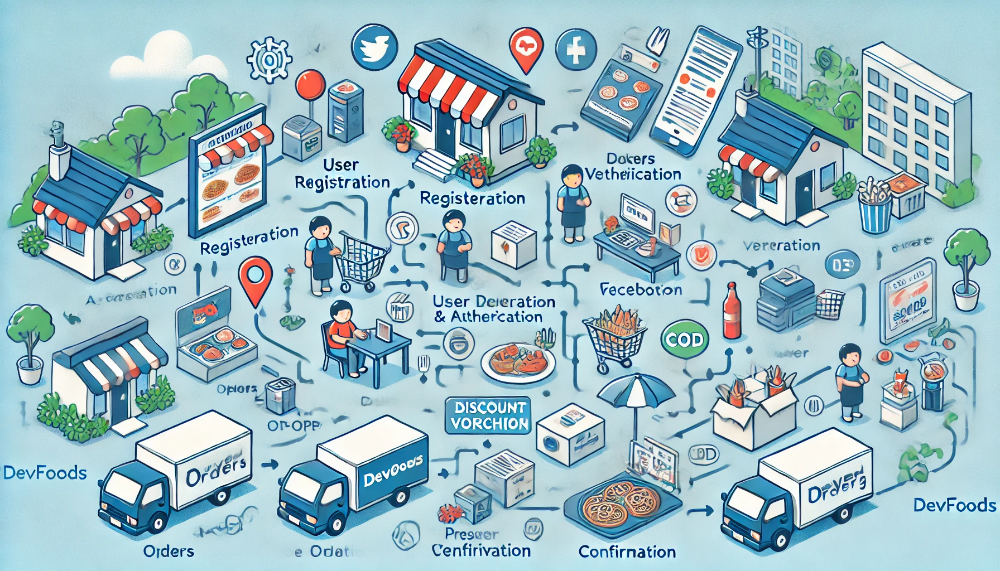

# Restaurant Management System

A full-stack web application for managing restaurants. The application was built by Laravel and ReactJS.

The application is divided into two main parts: the frontend and the backend. The frontend is built by ReactJS and is responsible for user interface. The backend is built by Laravel and is responsible for data processing and storage.

The application has the following features:

- User authentication: users can register and login to the application.
- User authorization: users can have different roles, for example, admin, staff, customer. Each role has different permissions.
- Menu management: admin can create, update, delete menus.
- Table management: admin can create, update, delete tables.
- Order management: customers can place orders, staff can manage orders.
- Report management: admin can view reports about orders, menus, tables.

